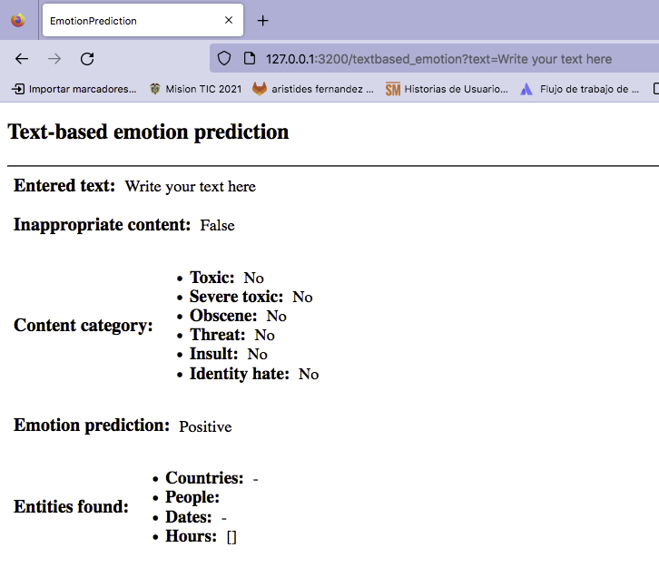

# Text-based emotion prediction

This app lets you know if the text content contains inappropriate language, if it represents a positive or negative emotion, and classifies the message into 6 categories (toxic, severe_toxic, obscene, threat, insult, identity_hate).

# Install app

First, create virtual environment

```
python3 -m venv "text_prediction"
```

Then, install requirements:

```
pip3 install -r requirements.txt
```

## Params:

```
text
```

## URL:

http://127.0.0.1:3200/textbased_emotion?text=Write%20your%20text%20here


## View




